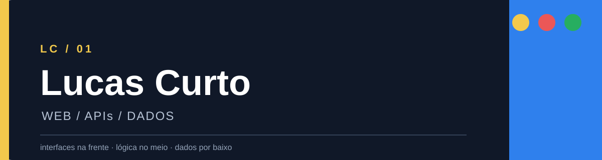

  

  
  

 

<h2 align="center">Uma stack em três camadas</h2>

<table align="center">
  <tr>
    <td align="center" width="33%">   <strong>NA FRENTE</strong> React · TypeScript HTML · CSS  </td>
    <td align="center" width="33%">   <strong>NO MEIO</strong> Python · FastAPI APIs HTTP  </td>
    <td align="center" width="33%">   <strong>POR BAIXO</strong> PostgreSQL · Docker Git · GitHub  </td>
  </tr>
</table>

<em>Não são tecnologias avulsas: são as camadas que aparecem nos projetos públicos.</em>

## O ponto de partida

Todo sistema grande precisa de um primeiro sinal de vida.

No **Cosmetics Hub**, esse sinal é `GET /health`: uma API que roda localmente, um teste automatizado que confirma o comportamento e um ambiente PostgreSQL preparado para desenvolvimento. A partir daí, a construção segue em direção a empresas, clientes, catálogo, estoque, pedidos e recebíveis — sem confundir o que está planejado com o que já existe.

## O que está sendo construído

  <table>
    <tr>
      <td width="50%" valign="top">
        <h3>API</h3>
        
<a href="https://github.com/lc-curto/distribution-hub-api">distribution-hub-api</a>

        
<code>GET /health</code> disponível teste automatizado documentação de produto e arquitetura

        
      </td>
      <td width="50%" valign="top">
        <h3>WEB</h3>
        
<a href="https://github.com/lc-curto/distribution-hub-web">distribution-hub-web</a>

        
React + TypeScript scaffold inicial frontend em repositório separado

        
      </td>
    </tr>
  </table>

## O mapa, não o discurso

O [roadmap do projeto](https://github.com/lc-curto/distribution-hub-api/blob/main/docs/learning-roadmap.md) mostra a sequência real: preparar o ambiente, entender o banco, criar os primeiros modelos, estruturar a API e só então avançar pelos fluxos do produto.

## Mais um projeto

**[Portifolio](https://github.com/lc-curto/Portifolio)** · portfólio público em HTML e CSS.

## Dados do perfil

  

  <a href="https://github.com/lc-curto"><strong>lc-curto</strong></a> · projetos, código e documentação

