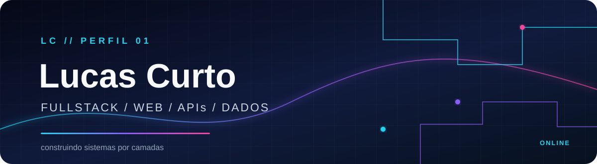

  

  

## FULLSTACK DEVELOPER

Interfaces on the surface. APIs in the structure. Data at the base.

I work on both ends of development: I build the interface, structure the backend and connect the data into systems that can be run and evolved.

I also run a cosmetics distribution company. That's where my current project comes from: I'm building the management software I'd like to have in day-to-day operations.

## CURRENT PROJECT / COSMETICS HUB

**Cosmetics Hub** is a commercial management MVP for cosmetics companies. The goal is to bring the flows behind a commercial operation into a single system: companies, customers, catalog, inventory, orders and receivables.

The project is split in two: a Python and FastAPI API that provides the backend foundation, and a React and TypeScript web app. The documentation follows the product from domain and requirements through to architecture and roadmap, keeping what is already implemented clearly separate from what is still only specified.

### [distribution-hub-api](https://github.com/lc-curto/distribution-hub-api)

`GET /health` available · automated test · PostgreSQL configured for local development

### [distribution-hub-web](https://github.com/lc-curto/distribution-hub-web)

React + TypeScript · separate frontend · initial scaffold

The current state is intentionally small. The [roadmap](https://github.com/lc-curto/distribution-hub-api/blob/main/docs/learning-roadmap.md) lays out the development sequence, starting with the environment and moving on to database, identity, companies and customers.

Status last updated: October 2026

## STACK

  

## OTHER PROJECTS

- [**Portifolio**](https://github.com/lc-curto/Portifolio) · public portfolio in HTML and CSS.

## EDUCATION

Training in software development with a focus on fullstack web: algorithms, object-oriented programming, SQL and NoSQL databases, frontend and backend development, frameworks, quality assurance, design patterns, UML, and web and mobile projects.

## CONTACT

  

